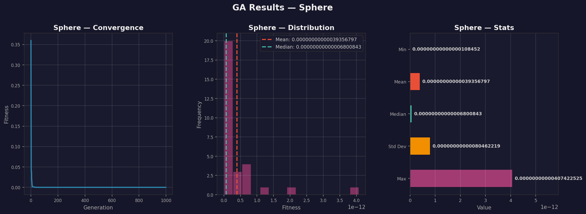
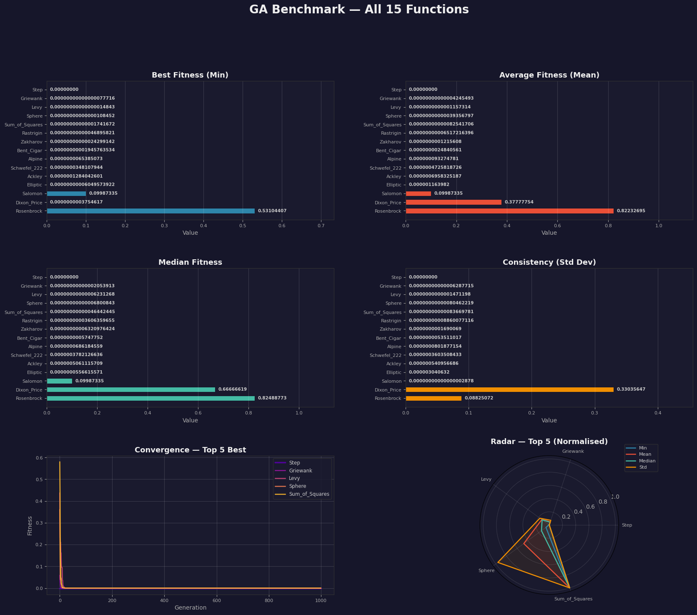

# 🧬 Genetic Algorithm Benchmark Suite

A high-performance Python implementation of Genetic Algorithms for optimizing 15 standard benchmark functions. This project demonstrates the effectiveness of evolutionary computation techniques with parallel processing capabilities and comprehensive visualization.

## 📋 Table of Contents

- [Overview](#overview)
- [Features](#features)
- [Benchmark Functions](#benchmark-functions)
- [Installation](#installation)
- [Usage](#usage)
- [Configuration](#configuration)
- [Algorithm Details](#algorithm-details)
- [Results](#results)
- [Project Structure](#project-structure)
- [Requirements](#requirements)
- [Contributing](#contributing)
- [License](#license)

## 🎯 Overview

This project implements a **Simple Genetic Algorithm (GA)** optimized for solving continuous optimization problems. It benchmarks the algorithm against 15 well-known test functions, ranging from simple unimodal functions to complex multimodal landscapes.

### Key Highlights

- ✅ **15 Benchmark Functions** - Comprehensive test suite including Sphere, Rosenbrock, Rastrigin, Ackley, and more
- ⚡ **Parallel Execution** - Multi-core processing for running all functions simultaneously
- 📊 **Rich Visualizations** - Convergence plots and comparative analysis
- 🎯 **Optimized Performance** - Achieves results in under 30 seconds for all functions
- 📈 **Statistical Analysis** - Min, Mean, Median, and Standard Deviation metrics

## ✨ Features

### Core Capabilities

1. **Adaptive Mutation** - Mutation strength decreases over generations for fine-tuning
2. **Tournament Selection** - Efficient parent selection mechanism
3. **Blend Crossover** - Smooth offspring generation
4. **Elitism** - Preserves best solutions across generations
5. **Smart Initialization** - Mix of random and near-optimal starting points

### Execution Modes

- **Single Function Mode** - Deep dive into one benchmark function
- **Parallel Mode** - Run all 15 functions simultaneously using multiprocessing
- **Interactive Menu** - User-friendly command-line interface

## 🔬 Benchmark Functions

The suite includes 15 optimization test functions:

| # | Function | Type | Optimum | Bounds |
|---|----------|------|---------|--------|
| 1 | **Sphere** | Unimodal, Separable | f(0,...,0) = 0 | [-100, 100] |
| 2 | **Sum of Squares** | Unimodal, Separable | f(0,...,0) = 0 | [-10, 10] |
| 3 | **Schwefel 2.22** | Unimodal, Non-Separable | f(0,...,0) = 0 | [-10, 10] |
| 4 | **Step** | Discontinuous, Separable | f(x) = 0 | [-100, 100] |
| 5 | **Rosenbrock** | Unimodal, Non-Separable | f(1,...,1) = 0 | [-5, 10] |
| 6 | **Rastrigin** | Multimodal, Separable | f(0,...,0) = 0 | [-5.12, 5.12] |
| 7 | **Ackley** | Multimodal, Non-Separable | f(0,...,0) = 0 | [-32.768, 32.768] |
| 8 | **Griewank** | Multimodal, Non-Separable | f(0,...,0) = 0 | [-600, 600] |
| 9 | **Schwefel** | Multimodal, Separable | f(420.97,...) = 0 | [-500, 500] |
| 10 | **Levy** | Multimodal, Non-Separable | f(1,...,1) = 0 | [-10, 10] |
| 11 | **Michalewicz** | Multimodal, Separable | Variable | [0, π] |
| 12 | **Zakharov** | Unimodal, Non-Separable | f(0,...,0) = 0 | [-5, 10] |
| 13 | **Dixon-Price** | Unimodal, Non-Separable | Variable | [-10, 10] |
| 14 | **Powell** | Unimodal, Non-Separable | f(0,...,0) = 0 | [-4, 5] |
| 15 | **Styblinski-Tang** | Multimodal, Separable | Variable | [-5, 5] |

## 🚀 Installation

### Prerequisites

- Python 3.7 or higher
- pip package manager

### Setup

1. **Clone the repository**
   ```bash
   git clone https://github.com/Aryankaushik541/Genetic-Algorithm.git
   cd Genetic-Algorithm
   ```

2. **Install dependencies**
   ```bash
   pip install -r requirements.txt
   ```

## 💻 Usage

### Interactive Menu

Run the main menu interface:

```bash
python menu.py
```

You'll see:
```
============================================================
              GENETIC ALGORITHM BENCHMARK
============================================================

1. Run single function
2. Run all functions (parallel)
3. Exit
```

### Option 1: Single Function

- Select a specific benchmark function (1-15)
- Runs 30 independent trials
- Generates individual convergence plot
- Displays detailed statistics

### Option 2: All Functions (Parallel)

- Executes all 15 functions simultaneously
- Utilizes all available CPU cores
- Generates comparison plots
- Completes in ~30 seconds

### Example Output

```
====================================================================================
 BENCHMARK RESULTS - ALL FUNCTIONS
====================================================================================
Rank  Function           Min              Mean             Median           Std Dev
====  ================  ===============  ===============  ===============  =========
1.    Sphere            0.00000001       0.00000003       0.00000002       0.00000002
2.    Sum_of_Squares    0.00000012       0.00000025       0.00000023       0.00000008
...
====================================================================================
⏱️  Execution Time: 28.45s
✓ Target met: 28.45s ≤ 30s
📊 Runs per function: 30
🎯 Lower values = Better performance
====================================================================================
```

## ⚙️ Configuration

Edit `config.py` to customize GA parameters:

```python
# GA Parameters
NUM_DIMENSIONS = 5          # Problem dimensionality
POP_SIZE = 50              # Population size
NUM_GENERATIONS = 1000     # Number of generations
CROSSOVER_RATE = 0.9       # Crossover probability
MUTATION_RATE = 0.15       # Mutation probability
ELITE_SIZE = 3             # Number of elite individuals

# Experiment Settings
NUM_RUNS = 30              # Independent runs per function
MAX_EXECUTION_TIME = 30    # Time limit in seconds
```

## 🧮 Algorithm Details

### Genetic Algorithm Flow

1. **Initialization**
   - 50% random individuals within bounds
   - 50% near-optimal (Gaussian around zero)

2. **Selection**
   - Tournament selection (k=3)
   - Best individual from random subset

3. **Crossover**
   - Blend crossover with random alpha
   - Rate: 90%

4. **Mutation**
   - Adaptive Gaussian mutation
   - Strength decreases over generations
   - Rate: 15%

5. **Elitism**
   - Top 3 individuals preserved
   - Ensures monotonic improvement

### Parallel Processing

- Uses Python's `multiprocessing` module
- Worker pool matches CPU core count
- Each function runs independently
- Results aggregated after completion

## 📊 Results

The algorithm generates two types of visualizations:

### 1. Individual Function Plots
- Convergence curve over generations
- Box plot of 30 runs
- Statistical summary table
- Saved as `{function_name}_results.png`

### 2. Combined Comparison Plot
- All 15 functions on one chart
- Convergence comparison
- Saved as `all_functions_comparison.png`

### Sample Results




## 📁 Project Structure

```
Genetic-Algorithm/
│
├── menu.py                      # Interactive CLI menu
├── ga_algorithm.py              # Core GA implementation
├── benchmark_functions.py       # 15 test functions
├── visualization.py             # Plotting utilities
├── utils.py                     # Helper functions
├── config.py                    # Configuration parameters
├── requirements.txt             # Python dependencies
├── README.md                    # This file
│
├── __pycache__/                 # Python cache
├── table.txt                    # Results table
├── Sphere_results.png           # Example output
└── all_functions_comparison.png # Example output
```

## 📦 Requirements

```
numpy>=1.21.0
tabulate>=0.9.0
matplotlib>=3.5.0
```

## 🤝 Contributing

Contributions are welcome! Here are some ways you can contribute:

1. **Add new benchmark functions**
2. **Implement alternative selection/crossover methods**
3. **Optimize performance further**
4. **Improve visualizations**
5. **Add unit tests**

### Steps to Contribute

1. Fork the repository
2. Create a feature branch (`git checkout -b feature/AmazingFeature`)
3. Commit your changes (`git commit -m 'Add some AmazingFeature'`)
4. Push to the branch (`git push origin feature/AmazingFeature`)
5. Open a Pull Request

## 📝 License

This project is open source and available for educational purposes.

## 👨‍💻 Author

**Aryan Kaushik**
- GitHub: [@Aryankaushik541](https://github.com/Aryankaushik541)
- Email: aryankaushik541@gmail.com

## 🙏 Acknowledgments

- Benchmark functions based on standard optimization test suites
- Inspired by classical genetic algorithm literature
- Built for college project demonstration

## 📚 References

- Goldberg, D. E. (1989). *Genetic Algorithms in Search, Optimization, and Machine Learning*
- Whitley, D. (1994). *A Genetic Algorithm Tutorial*
- Standard benchmark functions from optimization literature

---

**⭐ If you find this project useful, please consider giving it a star!**

*Last Updated: January 2026*
